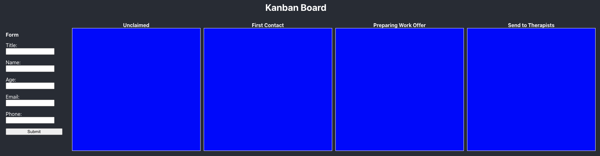

# Take Home Exercise

Thank you for taking the time to do this exercise. Please spend no longer than an hour on the below. If you enjoy the excercise and would like to continue, we would be delighted to interview. We will spend the first part of your interview discussing this work.

Please fork this repository and send us your answer. Remember to provide us relevant permission to access the repository.

## Brief: Trello Board Bookings

At HelloSelf, our operations team have to manage new bookings. We have a form to enter the member's details:

- Name
- Title
- Age
- Email
- Mobile Number

The board has 4 columns:

- **Unclaimed**: new cases
- **First Contact**: operations team contact member
- **Preparing Work Offer**: searching for Therapist
- **Send to Therapist**: matched with Therapist

This is what the board currenlty looks like:

The final design of the board is:

## Tasks

1. Please add validations to the member form, and relevant error and helper messages.
2. Once 'Submit' is pressed, a card will be created on under _Unclaimed_ column.
3. The card will contain all the details requested from the form.
4. Please save new card to _local storage_.
5. Previous entered cards will reload onto the board as saved in _local storage_.
6. Please add styling to the form and page.

## Bonus: Tasks

If you have time and feeling adventurous feel free to implement the bonus tasks listed below.

1. Implement the drag and drop of the cards to different columns.
2. Each column must indicate the number of cards.
3. Please add styling to the board and page.

## Review Interview

Once we have received your repository we will organise a follow-up interview to discuss your solution.

## How to run

We can created a simple App using create-react-app and the instructions on how to run can be found in [here](CONTRIBUTING.md).
